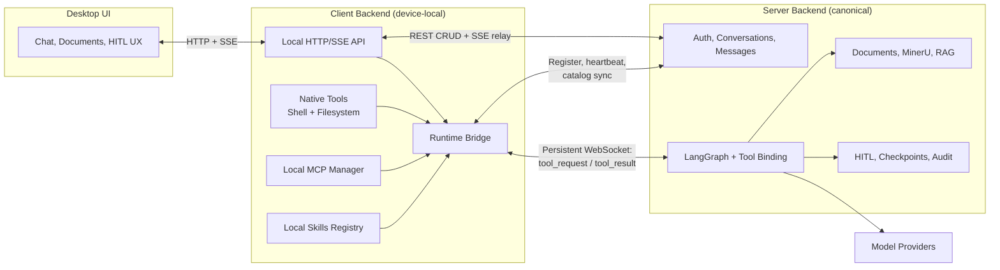
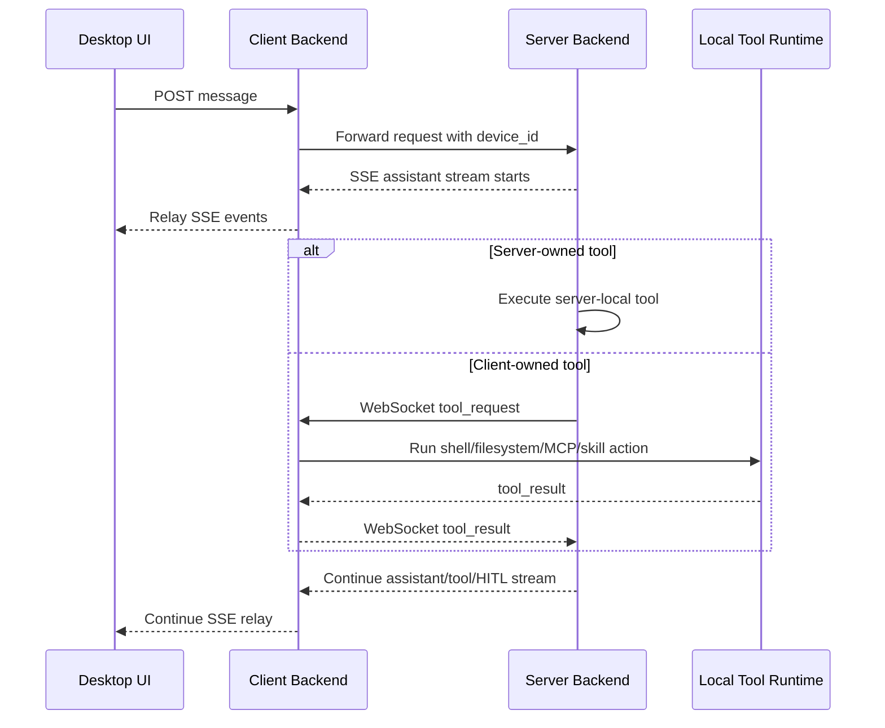

# Client Backend / Server Split Implementation Plan

Status: In Progress
Date: 2026-04-02
Repo scope: Same repository, new local-runtime folder

## Implementation Progress

### Phase 0: Baseline and Safety Rails
- [x] **Align ORM models with current Alembic head** (2026-03-23)
  - Created `app/models/client_device.py` with `ClientDevice` model and `DeviceStatus`, `DevicePlatform` enums
  - Created `app/models/document_parse_artifact.py` with `DocumentParseArtifact` model
  - Created `app/models/skill_setting.py` with `SkillSetting` model
  - Updated `app/models/hitl_interrupt.py` to add `device_id` (FK to client_devices) and `interrupt_metadata_json` columns
  - Updated `app/models/tool_approval.py` to add `device_id`, `tool_origin`, `server_name`, `qualified_tool_id` columns
  - Updated `app/models/__init__.py` to export all new models and enums
  - **Verified**: All models import successfully, columns match migration schema
- [x] **Add feature flags for client-runtime bridge** (2026-03-23)
  - Added to `app/core/config.py`:
    - `enable_client_runtime_bridge`: Master toggle (default: True)
    - `client_runtime_ws_timeout_seconds`: WebSocket operation timeout (default: 60s)
    - `client_runtime_catalog_cache_ttl_seconds`: Tool/skill catalog cache TTL (default: 300s)
    - `client_runtime_require_connected_device_for_local_tools`: Strict mode toggle (default: True)
    - `client_runtime_heartbeat_interval_seconds`: Expected heartbeat interval (default: 30s)
    - `client_runtime_max_tool_result_size_bytes`: Max tool result size (default: 1MB)
  - **Verified**: All settings load correctly with defaults
- [x] **Confirm server boots cleanly at migration head** (2026-03-23)
  - FastAPI app imports successfully (79 routes loaded)
  - All 14 tables registered in SQLAlchemy metadata
  - New device-related tables (`client_devices`, `document_parse_artifacts`, `skill_settings`) confirmed present
  - **Exit criteria met**: No schema/model drift, server starts with bridge disabled

### Phase 1: Scaffold client_backend/
- [x] **Create local FastAPI app with folder structure** (2026-03-23)
  - Created `client_backend/` with folders: `api/`, `core/`, `services/`, `schemas/`, `storage/profiles/`
  - Created `client_backend/main.py` with FastAPI app and lifespan management
  - Created `client_backend/__init__.py` with version
- [x] **Add config, logging, profile storage, and health endpoints** (2026-03-23)
  - Created `core/config.py` with `ClientSettings` for all client configuration
  - Created `core/logging.py` with structured logging to file and console
  - Created `core/paths.py` with path normalization, validation, and workspace sandboxing
  - Created `core/security.py` with local session tokens, device ID generation, and audit redaction
  - Created `api/health.py` with health check, readiness, liveness, status, and device info endpoints
  - Created `schemas/runtime.py` with runtime state, tool catalog, and dispatch schemas
  - Created `schemas/messages.py` with message and conversation schemas
- [x] **Add upstream server API wrapper** (2026-03-23)
  - Created `services/server_api.py` with async HTTP client for all server communication
  - Supports login, token refresh, conversations, messages, SSE streaming, and document upload
  - Created `services/upstream_auth.py` for managing server credentials and token storage
  - Created `api/auth.py` with login, logout, session restore, and local token verification endpoints
  - **Verified**: 16 routes registered (auth, health, status, device, docs)
  - **Exit criteria met**: Local backend can proxy basic server calls, auth working

### Phase 2: Device Registration and Runtime Session
- [x] **Implement client_devices repository on server** (2026-03-23)
  - Created `app/repositories/client_device.py` with full CRUD operations
  - Created `app/repositories/document_parse_artifact.py` for parse artifacts
  - Created `app/repositories/skill_setting.py` for per-user skill settings
  - Supports get by user/identifier, list by user, status updates, metadata updates
  - Includes stale device cleanup mechanism
- [x] **Implement client_devices service on server** (2026-03-23)
  - Created `app/services/client_device_service.py` with device session management
  - Manages shared runtime sessions with heartbeat tracking and Redis-compatible coordination
  - Handles tool and skill catalog caching per device session
  - Provides automatic stale session cleanup
  - Supports multiple devices per user
- [x] **Add device registration API endpoint on server** (2026-03-23)
  - Created `app/api/client_devices.py` with 6 endpoints:
    - `POST /client-devices/register`: Register or update device
    - `POST /client-devices/heartbeat`: Send heartbeat to keep session alive
    - `GET /client-devices/me`: List all user's devices
   - `PUT /client-devices/{device_id}/tool-catalog`: Update tool catalog
    - `PUT /client-devices/{device_id}/skill-catalog`: Update skill catalog
    - `GET /client-devices/{device_id}`: Get device info
  - Wired into main app, all routes protected by authentication
  - **Verified**: Server boots with 85 total routes (up from 79)
- [x] **Add device WebSocket connection endpoint on server** (2026-03-23)
  - Created `app/api/device_runtime.py` with WebSocket endpoint at `WS /device-runtime/{device_id}/connect`
  - Implemented `WebSocketMessage` class for structured message types (tool_request, tool_result, heartbeat, error, ack)
  - Implemented `DeviceRuntimeGateway` for bidirectional tool dispatch communication
  - Handles heartbeat processing, tool result collection, connection lifecycle
  - Added `GET /device-runtime/connected-devices` to list active device sessions
  - **Verified**: Server boots with 87 total routes (up from 85)
  - **Exit criteria met**: Real-time device communication channel established

### Phase 3: Local Tool Providers
- [x] **Implement shell runner service in client_backend** (2026-03-23)
  - Created `client_backend/services/shell_runner.py` for subprocess execution
  - Features: timeout enforcement, output size limits, shell allowlist (bash, sh, cmd, powershell)
  - Environment variable filtering and audit redaction
  - Command validation to block dangerous patterns (rm -rf/, fork bombs, etc.)
  - **Verified**: Default 60s timeout, 1MB max output, validation working
- [x] **Implement filesystem service in client_backend** (2026-03-23)
  - Created `client_backend/services/filesystem_service.py` for file operations
  - Full CRUD: read/write text and binary, list directories, create/delete files/dirs
  - Search functionality: by name pattern and content regex
  - Workspace sandboxing: all operations validated against allowed roots
  - **Verified**: 50MB file size limit, proper path validation
- [x] **Implement local MCP manager in client_backend** (2026-03-23)
  - Created `client_backend/services/local_mcp_manager.py` for MCP server management
  - Features: Config loading from JSON, stdio transport support, process lifecycle management
  - Tool discovery via MCP protocol (tools/list), tool calling (tools/call)
  - Support for environment variable expansion and working directory resolution
  - Generates sanitized tool catalogs with qualified IDs (server::tool format)
  - **Verified**: Config path resolution, catalog generation working
- [x] **Implement local skills registry in client_backend** (2026-03-23)
  - Created `client_backend/services/local_skills_registry.py` for skill management
  - Scans configured skill roots for SKILL.md files with async loading
  - Parses skill metadata (description, category, tags from front matter)
  - Enable/disable per skill, bulk operations support
  - Search by name/description/tags, filter by category
  - Generates skill catalogs with optional content inclusion (for enabled skills only)
  - **Verified**: Skill scanning, catalog generation, enable/disable working
- **Exit criteria met**: All local tool providers complete

### Phase 4: Server Tool Dispatch Integration
- [x] **Add device-scoped remote tool catalog cache on server** (2026-03-23)
  - Refactored `app/services/client_device_service.py` to use a shared runtime store instead of per-process in-memory state
  - Added one-time runtime `session_id` issuance/consumption so the WebSocket connect flow is tied to the registration response
  - Added per-session tool/skill catalog generation counters and timestamps to support cache invalidation for device-local bindings
  - Added helper accessors for user/device-scoped tool and skill catalogs
  - Updated server registration and WebSocket endpoints to issue and validate runtime session IDs through the shared registry
  - **Design decision**: Keep the catalog cache keyed by active runtime session in the shared runtime store so device-local capability state tracks the live WebSocket session rather than stale DB metadata
  - **Verified**: Cross-instance session visibility works and tool/skill catalog versions increment with deterministic cache keys
- [x] **Merge remote tools into server binding path** (2026-03-23)
  - Added `app/ai/client_runtime_tools.py` to build cached LangChain `StructuredTool` wrappers from synced client catalogs
  - Added request-scoped `device_id` propagation through `MessageCreate`, `AIService`, `GraphState`, and `ToolContext`
  - Updated graph nodes and tool-map construction to carry `device_id` into both model binding and tool execution
  - Updated RAG/chat/search/planning/image/canvas agent paths to pass device-aware binding parameters where needed
  - Updated AI SDK chat endpoint to accept `deviceId`/`device_id` passthrough into the shared message schema
  - **Design decision**: Expose client-local tools with a `client__...` prefix so they cannot collide with server-owned tool names while still preserving the original `qualified_tool_id` for dispatch/audit
  - **Verified**: `py_compile` passed for all changed server modules, and a focused runtime-wrapper smoke test confirmed `client__shell_execute` dispatched to `native::shell_execute` with the expected device-scoped arguments/result
- [x] **Dispatch client-local tool calls over WebSocket** (2026-03-23)
  - Added `client_backend/services/runtime_bridge.py` to own device registration, outbound runtime WebSocket lifecycle, heartbeat loop, reconnect policy, and catalog sync
  - Added native client tool catalog definitions for shell execution plus filesystem read/write/list/search
  - Added server API helpers for device registration, tool/skill catalog sync, and runtime WebSocket URL construction
  - Wired client auth login/restore/logout and app shutdown to start/stop the runtime bridge automatically
  - Updated health/status endpoints to read runtime state from the runtime bridge service
  - **Design decision**: Start the runtime bridge as a background service after upstream auth succeeds so the desktop can keep the canonical login flow while the device-runtime channel reconnects independently
  - **Verified**: A fake-server smoke test confirmed device registration, tool/skill catalog sync, runtime WebSocket connect/ack, and a full `tool_request` -> local shell execution -> `tool_result` round trip
- [x] **Return tool results into existing graph flow** (2026-03-23)
  - Reused the existing `execute_tool_calls` path so client-local tool wrappers return standard tool outputs and artifacts without changing LangGraph topology
  - Added interrupt payload staging in `app/ai/graph.py` so pending approvals keep device-aware provenance across checkpoint/recovery paths
  - Updated interrupt persistence/audit writes to store `device_id` plus `tool_origin`, `server_name`, and `qualified_tool_id` when resuming approved client-local tools
  - Updated interrupt recovery paths to reuse the enriched pending action payload from graph state instead of rebuilding a lossy version from raw tool calls
  - **Design decision**: Store client-tool provenance in interrupt metadata keyed by `tool_call_id`, then fan that metadata back into `tool_approvals` on resume so HITL audit stays additive and does not require schema changes to the interrupt response model
  - **Verified**: `execute_tool_calls` returned a client-local wrapper result as a normal success output/artifact, and a focused audit smoke test confirmed resume decisions persisted `device_id=...`, `tool_origin=client_native`, and `qualified_tool_id=native::shell_execute`
- **Exit criteria met**: A server-run conversation can bind client-local tools, dispatch them over the device runtime channel, and recover device-aware HITL provenance without rewriting the existing graph flow

### Production Hardening Pass
- [x] **Replace process-local sidecar session state with a shared runtime store** (2026-04-02)
  - Added `app/services/client_runtime_store.py` with Redis-backed coordination for runtime sessions, request queues, pending-request tracking, and result delivery
  - Kept an in-memory fallback for local development/tests when Redis or the `redis` package is unavailable
  - Moved `ClientDeviceService` and the WebSocket gateway onto the shared runtime store so multiple server workers can address the same connected sidecar
  - Added stale-session cleanup on FastAPI lifespan startup/shutdown
  - **Verified**: runtime state no longer depends on a single Python worker process, and disconnects now fail pending tool calls instead of silently timing out
- [x] **Finish device/session isolation for tools, skills, and interrupt resume** (2026-04-02)
  - Fixed deferred loading so client-local tools are only bound after `tool_search` loads them for the active conversation/device
  - Enforced client-side HITL approval by default for `client__...` tools even when the explicit allowlist is empty
  - Added `device_id` validation for interrupt resume paths so a paused tool approval cannot be resumed from the wrong sidecar
  - Hardened client tool/skill catalog lookups to reject mismatched user/device sessions
  - **Verified**: new regression tests cover sidecar tool isolation, deferred client-tool binding, HITL defaults, stale-session cleanup, and device-bound interrupt resume
- [x] **Stabilize client runtime shutdown semantics** (2026-04-02)
  - Updated the client runtime bridge to wait for the canonical backend to observe disconnects before reporting the sidecar as fully stopped
  - Preserved the existing outbound WebSocket model and NAT-safe transport assumptions from the plan's Mermaid diagrams
  - **Verified**: live runtime integration now passes cleanly through connect, server visibility, disconnect, and post-disconnect cleanup

### Architecture Addendum: Multi-Sidecar Hardening (2026-04-07)

This addendum clarifies the production shape for simultaneous multi-sidecar use.

#### Key conclusions

- `device_id` must remain transport-owned metadata carried by the client backend and server, not a model-facing tool argument.
- The model must never be asked to invent or select a raw device UUID.
- A single model run should bind to exactly one execution scope:
  - `(user_id, device_id, session_id, catalog_version)`
- Client tool visibility must remain scoped to the active execution scope only.
- HITL, deferred loading, and runtime dispatch must all validate against the same execution scope.

#### Current strengths already in place

- Request-scoped `device_id` is already propagated through message -> workflow -> tool context.
- Client tools are bound only for the active request device and validate their bound `device_id` and `session_id` at execution time.
- Client-side tools require HITL approval by default.
- Interrupt resume already validates `device_id`.
- Tool catalogs and runtime dispatch queues are already keyed to active runtime sessions.

#### Production gaps still remaining

- `DeferredToolState` currently keys loaded tools by `(conversation_id, agent_key)` only.
  - This is acceptable for server MCP tools.
  - This is fragile for client tools when the same conversation is used from multiple sidecars because loaded client tools can share one pool and one LRU budget across devices.
- Loaded client tools are keyed by exposed tool name.
  - If two sidecars load the same exposed client tool name in the same conversation, one record can replace the other.
- The sidecar runtime currently executes a request from `qualified_tool_id` alone once it has been routed to the device.
  - This is functional today because the server routes by `device_id`.
  - It is not the strongest production proof that the request still belongs to the current sidecar session and current advertised capability set.
- The `device_id is None` fallback in `base_agent._get_tools_for_binding()` passes all loaded client tools when no device is in context.
  - This is the legacy path for server-only requests.
  - When the bridge is enabled, a missing `device_id` should produce zero client tools, not all tools.
  - The current permissive fallback is a latent cross-device leak path if `device_id` is absent by accident rather than by design.
- `dispatch_tool_call()` on the server does not verify that `qualified_tool_id` exists in the session current tool catalog before dispatching.
  - Sidecar-side rejection covers this, but server-side validation is defense-in-depth.
- `hitl_interrupts` and `tool_approvals` do not store `session_id` or `catalog_version`.
  - Device ID mismatch is detected on resume, but a session change within the same device is not.

#### Required architecture decisions

- Do not persist a hard one-conversation -> one-device binding as the primary model.
  - Conversations remain user-owned.
  - Device selection is execution-scoped per request and per interrupt.
- Introduce an opaque client capability identifier for each advertised client tool.
  - Recommended name: `tool_instance_id`
  - Build it as a truncated SHA-256 of `{device_id}:{session_id}:{qualified_tool_id}:{catalog_version}`.
    - SHA-256 is compact, O(1) to compare, and safe to log without leaking internal structure.
    - Alternatively, use the structured composite `{device_id}:{session_id}:{qualified_tool_id}:{catalog_version}` if debuggability is preferred over compactness.
    - Either format is acceptable; pick one and apply it consistently across catalog, protocol, and audit.
  - `catalog_version` is **session-scoped**, not device-scoped. It resets to 0 when a new session starts. A reconnect with a new session produces a new `tool_instance_id` even if the catalog is identical. Document this at the definition site.
  - The model still sees only the exposed tool name.
  - The server and sidecar use the opaque identifier for dispatch and validation.
- Treat `qualified_tool_id` as descriptive provenance, not as the sole authority for execution.
- Tighten the `device_id is None` fallback: when `enable_client_runtime_bridge` is true and `device_id` is absent, bind zero client tools. Do not fall through to include all loaded client tools.
- Any future multi-device orchestration must be server-owned.
  - If a user wants to target a different device, the server or client backend selects the execution scope first.
  - Only then are that scope's client tools bound to the model.
  - Do not expose raw device UUIDs in prompts or tool schemas.

#### HITL compatibility requirements

- HITL remains compatible with multi-sidecar support if approvals are bound to execution scope.
- Persist the following on interrupt and approval records for client-local tools:
  - `device_id`
  - `session_id`
  - `tool_origin`
  - `server_name`
  - `qualified_tool_id`
  - `tool_instance_id`
  - `catalog_version`
- Schema changes needed: add `session_id VARCHAR(255)` and `catalog_version INT` columns to both `hitl_interrupts` and `tool_approvals` in a new Alembic migration.
- Resume rules:
  - same conversation + same interrupt + same execution scope: allow normal resume
  - same conversation + different device/session/catalog: reject or require explicit rebind with fresh approval
- If the device disconnects or reconnects with a new session before resume, pending client-tool approvals should be considered stale unless revalidated.

#### Deferred loading compatibility requirements

- Deferred loading remains compatible only if client-loaded state becomes execution-scope aware.
- Server tool deferred state can continue using `(conversation_id, agent_key)`.
- Client tool deferred state should be keyed by:
  - `(conversation_id, agent_key, device_id, session_id)`
  - or an equivalent execution-scope key
- Client tool LRU and capacity limits should apply per execution scope, not across every device participating in the same conversation.
- `tool_search` should continue searching only the active device's client catalog for the current request.
- Internal autoload metadata should carry `tool_instance_id` and execution-scope information, not just exposed tool name and server name.
- Migration note: splitting the deferred-state key is a clean break. Existing `LoadedClientTool` entries under the old `(conversation_id, agent_key)` key are silently dropped on the first access after the change. No backward migration is needed; loaded tools are re-acquired on the next `tool_search` call.

#### Recommended runtime-dispatch contract

- Tool catalogs synced from sidecar -> server should include:
  - exposed tool name
  - `qualified_tool_id`
  - `tool_instance_id`
  - `catalog_version`
  - schema fingerprint
  - origin metadata
- Server -> sidecar `tool_request` should include:
  - `request_id`
  - exposed tool name
  - `qualified_tool_id`
  - `tool_instance_id`
  - expected `session_id`
  - expected `catalog_version`
  - arguments
- Sidecar must reject execution if:
  - `tool_instance_id` is unknown
  - `session_id` does not match current runtime session
  - catalog version is stale
  - exposed tool name does not match the advertised record
  - `qualified_tool_id` does not match the advertised record
- Server must also validate before dispatch (defense-in-depth):
  - `qualified_tool_id` exists in the active session's tool catalog
  - session is alive and `user_id` matches
  - `bound_session_id` matches if provided

#### Explicit guidance for the LLM / device selection

- In the current architecture, the LLM should not hallucinate `device_id` because `device_id` is not a model-visible tool argument.
- That must remain true.
- If multi-device selection UX is needed later, use one of these patterns:
  - client/backend preselects the active device before the request reaches the model
  - a server-owned broker tool resolves the target device and then rebinds tools for a second model step
- Avoid any design where the model directly emits `device_id` into a client-local tool call.

#### Next implementation tasks

- [x] Split deferred client-tool state by execution scope instead of conversation-only state (2026-04-08)
  - Key: `(conversation_id, agent_key, device_id, session_id)`
  - Per-scope LRU budget; no sharing across devices in the same conversation
  - Clean break: existing client entries under the old key are silently dropped; tools re-load on next `tool_search`
  - Introduced `ClientToolScope` dataclass with its own LRU pool separate from `ConversationToolSet`
  - `DeferredToolState` now maintains two dicts: `_conversation_tools` (server) and `_client_tool_scopes` (client, execution-scope keyed)
  - Updated `autoload_client_tools`, `get_loaded_client_tools`, `get_all_loaded_tool_names`, `clear_conversation`, `clear_all`, `get_stats`
  - Updated consumers in `base_agent.py` and `tool_execution.py` to pass `device_id` to scoped queries
  - **Design decision**: `session_id` is resolved lazily from the active device session when not explicitly provided, avoiding the need to thread it through all callers immediately
  - **Verified**: All 17 existing tests pass (6 isolation, 4 adapter utils, 7 local MCP manager)
- [x] Add `tool_instance_id` to the client tool catalog, runtime protocol, interrupt metadata, and audit records (2026-04-08)
  - **Design decision**: Used truncated SHA-256 (16 hex chars) of `{device_id}:{session_id}:{qualified_tool_id}:{catalog_version}` for compactness
  - **Design decision**: `catalog_version` is session-scoped; documented in `make_tool_instance_id()` docstring; sidecar tracks locally mirroring server counter
  - Added `make_tool_instance_id()` to `app/ai/client_runtime_tools.py` (canonical server-side) and `_make_tool_instance_id()` to `client_backend/services/runtime_bridge.py` (sidecar-side)
  - Added `tool_instance_id` field to `ClientRuntimeToolSpec`, `LoadedClientTool`, `ClientToolReference`
  - Sidecar embeds `tool_instance_id` in each catalog entry using next_catalog_version before sync
  - `ToolDispatchRequest` extended with `tool_instance_id`, `expected_session_id`, `expected_catalog_version`
  - `dispatch_tool_call()` passes `tool_instance_id` and current session fields in the request
  - Interrupt provenance now includes `tool_instance_id` and `session_id` from tool metadata
  - **Verified**: All 17 tests pass
- [x] Make the sidecar validate every tool request against its current advertised capability record before execution (2026-04-08)
  - Reject if `tool_instance_id` is unknown, `session_id` mismatches, catalog version is stale, or name/ID mismatches
  - Added `_validate_tool_request(request)` to `runtime_bridge.py` — returns error string or None
  - Sidecar tracks `_tool_catalog_version: int` (mirrors server-side increment) and `_current_tool_catalog: dict` (keyed by qualified_id)
  - Both reset on new session assignment; catalog version increments on each `refresh_catalogs()` call
  - `_handle_tool_request` calls validation first; raises `ValueError` if stale
  - **Design decision**: `tool_instance_id` formula uses `next_catalog_version = version + 1` at build time so the embedded ID matches what the server will assign after sync
  - **Verified**: `py_compile` passes
- [x] Add server-side catalog validation in `dispatch_tool_call()` before queuing the request (2026-04-08)
  - Verify `qualified_tool_id` exists in `session.tool_catalog`
  - Added defense-in-depth check in `client_device_service.py`: builds `catalog_qids` set from session catalog, raises `RuntimeError` if tool not present
  - `ToolDispatchRequest` now includes `tool_instance_id`, `expected_session_id`, `expected_catalog_version`
  - **Verified**: `py_compile` passes
- [x] Tighten `device_id is None` fallback in `base_agent._get_tools_for_binding()` (2026-04-08):
  - When `enable_client_runtime_bridge` is true and `device_id` is absent, bind zero client tools
  - Added explicit guard: `if settings.enable_client_runtime_bridge and not device_id: remote_tools = []`
  - `get_loaded_client_tools` call now passes `device_id=str(device_id) if device_id else None`
  - **Verified**: `py_compile` passes, all 17 tests pass
- [x] Add `session_id` and `catalog_version` columns to `hitl_interrupts` and `tool_approvals` (new Alembic migration) (2026-04-08)
  - Capture at interrupt creation time; validate on resume
  - New migration: `n5o6p7q8r9s0_add_session_id_catalog_version_to_hitl.py` (down_revision: `m4n5o6p7q8r9`)
  - Adds `session_id VARCHAR(255)`, `catalog_version INTEGER`, `tool_instance_id VARCHAR(64)` to both tables
  - Model columns added to `hitl_interrupt.py` and `tool_approval.py`
  - `HITLInterruptRepository.create()` extended with `session_id`, `catalog_version`, `tool_instance_id` params
  - `message_service.py` now extracts and passes these fields from interrupt provenance
  - **Verified**: `py_compile` passes on all modified files
- [x] Invalidate or re-approve pending client-tool interrupts when the sidecar session changes (2026-04-08)
  - Added `expire_stale_client_tool_interrupts(device_id, current_session_id) -> int` to `HITLInterruptRepository`
  - Uses bulk UPDATE: sets status=EXPIRED, resolution_source="session_changed" for PENDING interrupts with mismatched session_id
  - Called from `device_runtime.py` after `start_session()` in a try/except so connection is never blocked
  - **Verified**: `py_compile` passes on all modified files
- [x] Add regression tests for multi-sidecar scenarios (2026-04-08)
  - New file: `tests/test_multi_sidecar_hardening.py` — 19 tests across 7 test classes
  - **TestOverlappingToolNames** (2 tests): two sidecars publish same tool name in same conversation; verifies independent scopes and distinct `tool_instance_id`s; broad lookup returns both devices
  - **TestReconnectInvalidatesInstanceId** (6 tests): `tool_instance_id` changes on new session; changes on catalog version bump; sidecar `_validate_tool_request` rejects stale session, stale catalog version, unknown tool, mismatched `tool_instance_id`; accepts valid request
  - **TestHITLResumeSessionValidation** (1 test): interrupt resume rejects when device changes (409 INTERRUPT_DEVICE_MISMATCH)
  - **TestDeferredAutoloadIsolation** (2 tests): two devices get independent LRU pools; overflowing device A evicts from A not B
  - **TestNoDeviceBindsZeroTools** (2 tests): `_get_tools_for_binding` with `device_id=None` skips client tools entirely; `autoload_client_tools` returns [] without device
  - **TestClientToolScope** (3 tests): add/retrieve, LRU eviction within scope, update existing tool
  - **TestToolInstanceIdConsistency** (2 tests): server and sidecar produce identical IDs; different inputs produce different IDs
  - **Verified**: All 25 tests pass (6 existing + 19 new) in 3.1s

## 1. Objective

Build a new per-device client backend for the Codex Desktop App while keeping the current FastAPI server as the canonical backend for:

- user accounts and auth
- conversations and messages
- model/provider configuration
- LangGraph execution state and checkpoints
- HITL interrupt lifecycle and audit records
- documents, MinerU processing, RAG storage, and database persistence

The split must minimize changes to the current server behavior. The Streamlit demo remains unchanged and is explicitly out of scope for the new runtime.

## 2. Locked Decisions

- The new client backend will live in a new folder inside this repo.
- The existing `demo.py` Streamlit client remains legacy and should not be coupled to the new runtime.
- The client backend owns:
  - local script execution
  - local filesystem access
  - local MCP server management from device JSON config
  - local skill loading from device paths
  - document upload relay to the server
- The server backend owns:
  - all user/account/conversation/message state
  - document processing and parse/storage lifecycle
  - RAG/Qdrant and database persistence
  - HITL/checkpoints/audit
- MCP setup is per user.
- Skills are per device.
- Documents and parse artifacts remain server-side and scoped by user/conversation.
- Best-practice, production-ready defaults are preferred when requirements are ambiguous.
- Ignore the current `shared_contracts/` artifact folder. Do not rely on it.

## 3. Current-State Audit

### 3.1 Coupling That Exists Today

- `demo.py` imports server-side Python directly (`app.services.stream_events`) instead of consuming a pure client contract.
- MCP is process-global and file-global through `app/ai/mcp_config.json`.
- Skills are process-global and file-global through `app/ai/skills_registry.py` and `app/ai/skills_config.json`.
- Tool execution is server-local through the generic `app/ai/tool_execution.py` path.
- Document processing, MinerU output, image extraction, Qdrant upsert, and cleanup are server-local.

### 3.2 Existing Server Invariants Worth Preserving

- Users own conversations.
- Conversations own messages and documents.
- Message streaming already works over SSE.
- Provider/model configuration is already per-user and should stay server-owned.
- Document upload ownership checks and background processing are already implemented.
- LangGraph checkpoints are server-backed.

### 3.3 Schema Drift Already Present

The latest Alembic history already adds device-oriented tables and columns:

- `client_devices`
- `conversation_device_bindings`
- `document_parse_artifacts`
- `skill_settings`
- `hitl_interrupts.device_id`
- `hitl_interrupts.interrupt_metadata_json`
- `tool_approvals.device_id`
- `tool_approvals.tool_origin`
- `tool_approvals.server_name`
- `tool_approvals.qualified_tool_id`

But the ORM/services do not yet fully implement these models/fields. This must be reconciled before the split becomes reliable.

### 3.4 Important Gaps

- Focused automated coverage now exists for the client-backend bridge, unified tool search, and sidecar isolation/resume edge cases.
- Broader server integration coverage is still selective rather than exhaustive.
- `document_parse_artifacts` exists in migrations but parse artifacts are not yet being persisted as first-class records.
- `conversation_device_bindings` implies one conversation -> one device, which conflicts with the desired ChatGPT-like user-owned conversation model.

## 4. Design Principles

- Additive server change first. Do not rewrite the current chat/document architecture.
- Keep the server as the system of record.
- Move only device-local responsibilities to the new client backend.
- Never store raw local MCP secrets, raw env values, or unbounded local absolute paths on the server.
- Per-user isolation and per-device isolation must be explicit.
- Local runtime must not import application behavior from `app/`; shared behavior must be promoted into explicit contracts/utilities if needed.
- Preserve current server APIs for existing clients wherever possible.
- Prefer connection patterns that work behind NAT and on arbitrary user machines.

## 5. Recommended Target Architecture

### 5.1 High-Level Roles

| Layer | Responsibility |
| --- | --- |
| Desktop UI | Talks only to local client backend |
| Client backend | Local runtime, session manager, local tool execution, local MCP, local skills, upload relay |
| Server backend | Canonical data/model backend, orchestration, checkpoints, HITL, documents, RAG, audit |
| Model providers | Unchanged external providers called by server |

### 5.2 Transport Model

| Link | Recommended transport | Reason |
| --- | --- | --- |
| UI <-> client backend | HTTP + SSE, optional local WebSocket for live status | Keeps the local API close to the current server pattern |
| Client backend <-> server | REST for CRUD + one persistent outbound WebSocket for runtime events | Production-friendly, NAT-safe, supports server-to-device tool dispatch |
| Server <-> model providers | Existing provider integrations | No need to change |

### 5.3 Ownership Matrix

| Concern | Owner after split | Notes |
| --- | --- | --- |
| Login/logout/refresh with canonical user account | Server |
| Upstream token storage and refresh handling | Client backend |
| UI-local session to local backend | Client backend |
| Conversations/messages/checkpoints | Server |
| Provider/model config | Server |
| Local filesystem access | Client backend |
| Local script/shell execution | Client backend |
| Local MCP JSON config and MCP sessions | Client backend |
| Local skills from device paths | Client backend |
| Tool-call planning and model reasoning | Server |
| HITL interrupt ownership/audit | Server |
| Document upload initiation | Client backend relays to server |
| MinerU parse, image extraction, storage, RAG indexing | Server |
| Document/image/delete cleanup | Server |

### 5.4 Core Runtime Pattern

#### Mermaid Architecture View



1. The desktop UI calls the local client backend instead of the remote server directly.
2. The client backend authenticates to the server and keeps upstream tokens locally.
3. The client backend registers a device session with the server and opens one persistent WebSocket.
4. The client backend syncs a sanitized catalog of:
   - local native tools
   - local MCP tools
   - local skills
5. The server continues to run the model workflow and bind tools.
6. When a tool call targets a client-local tool, the server dispatches that request over the device WebSocket.
7. The client backend executes the tool locally, returns the result, and the server resumes the same LangGraph run.
8. The server streams assistant/tool/HITL events back through the normal response stream; the client backend relays those events to the desktop UI.

This keeps execution state centralized on the server while moving only local side effects to the device.

Production note:
- live runtime session metadata and queued tool requests must be stored in a shared coordinator, not process-local Python memory
- Redis is the preferred production backend for that coordination layer
- in-memory runtime state is acceptable only for local development and tests

## 6. Recommended Repo Layout

Create a new top-level folder:

```text
client_backend/
  __init__.py
  main.py
  api/
    auth.py
    conversations.py
    messages.py
    documents.py
    mcp.py
    skills.py
    runtime.py
  core/
    config.py
    logging.py
    paths.py
    security.py
  services/
    server_api.py
    upstream_auth.py
    device_identity.py
    device_session.py
    runtime_gateway.py
    shell_runner.py
    filesystem_service.py
    local_mcp_manager.py
    local_skills_registry.py
    document_upload_service.py
  schemas/
    runtime.py
    mcp.py
    skills.py
    messages.py
  storage/
    profiles/
```

Recommended rule:

- `client_backend/` may depend on explicit contract modules.
- `client_backend/` must not import business logic from `app/`.

## 7. Server Changes: Keep Them Additive and Contained

### 7.1 First Priority: Align ORM With Existing Alembic Head

Before any new feature work:

- add ORM models for `client_devices`, `document_parse_artifacts`, and `skill_settings`
- update `HITLInterrupt` model to include `device_id` and `interrupt_metadata_json`
- update `ToolApproval` model to include:
  - `device_id`
  - `tool_origin`
  - `server_name`
  - `qualified_tool_id`
- add repositories/services for the missing tables

This is mandatory because the database schema is already ahead of the application layer.

### 7.2 Do Not Use `conversation_device_bindings` as Conversation Ownership

The desired product model is user-owned conversations, not device-owned conversations.

Plan decision:

- do not make this table part of canonical conversation ownership
- do not block multi-device conversation access on this table
- if device affinity is needed later, use it only as an optional runtime hint or replace it with a new session-oriented table

### 7.3 New Additive Server Modules

Recommended server additions:

- `app/models/client_device.py`
- `app/models/document_parse_artifact.py`
- `app/models/skill_setting.py`
- `app/repositories/client_device.py`
- `app/repositories/document_parse_artifact.py`
- `app/repositories/skill_setting.py`
- `app/services/client_device_service.py`
- `app/services/device_runtime_service.py`
- `app/api/client_devices.py`
- `app/api/device_runtime.py`

### 7.4 Keep Existing User-Facing APIs Stable

Do not break:

- auth routes
- conversations routes
- messages routes
- AI SDK routes
- providers/model-config routes
- documents routes

Instead:

- add optional device context to relevant message/AI SDK calls
- keep legacy clients working when no device runtime is connected

## 8. Client Device and Session Model

### 8.1 Identity Model

Use these concepts:

- `device_identifier`: stable per installation/device
- `device_session_id`: ephemeral per connected runtime session
- `user_id`: canonical server user

This matches the existing uniqueness shape of `(user_id, device_identifier)` while allowing the same physical device to host multiple user profiles.

### 8.2 Local Profile Model

Recommended local storage namespace:

- per server origin
- per user
- per device

Example logical layout:

```text
profiles/
  {server_origin_hash}/
    {user_id}/
      session/
      mcp/
      skills/
      logs/
      runtime.db
```

### 8.3 Auth Handling

Production-ready recommendation:

- store upstream server tokens in OS credential storage where possible
- fall back to encrypted local storage only if keychain support is unavailable
- issue a local session token/cookie from the client backend to the UI
- bind the local backend to loopback only (`127.0.0.1`), not LAN

This replaces the insecure `localStorage` style used by the Streamlit demo.

## 9. MCP Strategy

### 9.1 Local Ownership

The local client backend owns:

- the MCP JSON config file
- path resolution for relative `args`/`cwd`
- env expansion for `${VAR}` placeholders
- stdio/http MCP connection lifecycle
- local tool catalog generation

### 9.2 Compatibility Goal

Keep the local JSON shape as close as possible to the current `app/ai/mcp_config.json` format so existing MCP definitions can be migrated with minimal friction.

### 9.3 Server-Side Handling

The server should store only:

- device capability metadata
- sanitized tool schemas
- tool names/descriptions
- tool origin and qualified tool IDs
- optional non-secret config fingerprints

The server should not persist:

- raw command env secrets
- raw local shell env blobs
- arbitrary absolute paths beyond normalized, policy-approved forms

### 9.4 Multi-User Isolation

Because MCP setup is per user:

- local MCP configs must be stored per local user profile
- server-side cached catalogs must be keyed by both `user_id` and `device_id`
- no tool catalog should leak across users on the same machine

## 10. Skills Strategy

### 10.1 Local Ownership

The client backend owns:

- scanning skill roots on disk
- local enable/disable state per user/device
- loading `SKILL.md` files
- sending skill summaries and enabled full-content payloads to the server

### 10.2 Server-Side Use

The server still needs skill data because the model runs server-side.

Recommended approach:

- sync skill summaries to the server for prompt construction
- sync enabled skill full content to a device-session cache
- refactor the current `activate_skill` logic to read from device-session skill cache first
- keep server-global skills as an optional fallback path for legacy/server-local skills

### 10.3 Important Rule

Do not keep using the current global filesystem-backed `SkillsRegistry` as the only source of truth once per-device skills are enabled, or skills will leak across users/devices.

## 11. Local Tooling Strategy

### 11.1 Native Client Tools

Implement native client-owned tools for:

- shell/script execution
- filesystem browse/read/write/search

These should not depend on local MCP for the basics.

### 11.2 Security Controls

Required controls:

- allowlisted workspace roots
- normalized and canonicalized paths before execution
- explicit working-directory rules
- shell allowlist and timeout limits
- stdout/stderr size caps
- env allowlist or overlay model, not full inheritance dumps
- audit-safe argument normalization before persistence

### 11.3 Audit Shape

For local tools, persist:

- `device_id`
- `tool_origin` such as `client_native` or `client_mcp`
- `server_name` when relevant
- `qualified_tool_id`
- path-normalized/redacted args in approval/audit records

## 12. Three-Sided Streaming Design

### 12.1 Streams to Support

- UI <-> client backend assistant stream
- client backend <-> server request/response stream
- server <-> client backend tool dispatch channel

### 12.2 Recommended Flow

#### Mermaid Sequence View



1. UI posts message to local client backend.
2. Client backend forwards message to server with `device_id` context.
3. Server starts the existing SSE assistant stream.
4. If the model calls a server-owned tool, server executes it locally as today.
5. If the model calls a client-owned tool, server dispatches a `tool_request` over the device WebSocket.
6. Client backend executes the local tool and sends `tool_result`.
7. Server resumes the graph and continues SSE output.
8. Client backend relays the SSE back to the UI.

### 12.3 Reliability Requirements

- keep the existing server SSE heartbeat behavior
- add WebSocket ping/pong for the device runtime connection
- require correlation IDs for:
  - request
  - conversation
  - device session
  - tool call
- make disconnect behavior explicit:
  - pure server requests should still work without a client runtime
  - local-tool requests should fail clearly and recoverably

## 13. API and Contract Changes

### 13.1 Additive Server APIs

Recommended server additions:

- `POST /client-devices/register`
- `POST /client-devices/heartbeat`
- `GET /client-devices/me`
- `PUT /client-devices/{device_id}/tool-catalog`
- `PUT /client-devices/{device_id}/skill-catalog`
- `WS /device-runtime/{device_id}/connect`
- `GET /documents/{document_id}/artifacts`
- `GET /documents/{document_id}/artifacts/{artifact_id}`

Keep message APIs backward-compatible by making device context optional:

- `POST /messages/stream`
- `POST /messages/resume-interrupt`
- `POST /api/chat/{conversation_id}`
- `POST /ai/resume-interrupt`

Add optional device/session context via headers or request fields, not by breaking existing schemas.

### 13.2 Local Client APIs

Recommended local API surface:

- auth/session proxy endpoints
- conversation/message proxy endpoints
- local MCP management endpoints
- local skills management endpoints
- local runtime status endpoint
- document upload relay endpoint

Where practical, mirror existing server request/response shapes so the desktop UI does not need two radically different API models.

## 14. Workflow Integration Plan

### 14.1 Reuse the Existing Tool Execution Seam

The current `app/ai/tool_execution.py` is already the cleanest integration point.

Recommended approach:

- add a remote-client tool wrapper/executor path
- extend tool binding to merge:
  - server tools
  - remote client-native tools
  - remote client-MCP tools
- keep LangGraph topology stable
- avoid rewriting the main graph unless absolutely necessary

### 14.2 Device-Aware Tool Catalog

Introduce a device-scoped tool catalog cache keyed by:

- `user_id`
- `device_id`
- `device_session_id`
- catalog generation/version

This cache should feed model binding for a request that originated from that device.

Implementation note:
- the cache must be backed by the shared runtime store so any server worker can resolve the active sidecar session
- queued tool dispatch and pending request tracking must live beside the session metadata to survive cross-worker routing
- deferred loading applies to client-local tools as well as server MCP tools; unloaded client tools must not be eagerly rebound

### 14.3 HITL and Resume

Keep HITL server-owned. Extend it to capture device provenance:

- write `device_id` into `hitl_interrupts`
- write `device_id`, `tool_origin`, `server_name`, and `qualified_tool_id` into `tool_approvals`
- ensure resumed runs still target the correct active device session when local tools are involved

## 15. Documents, MinerU, RAG, and Artifact Plan

### 15.1 Upload

The client backend should stream file uploads to the server and reuse existing auth and conversation ownership rules.

### 15.2 Processing

Document processing stays on the server:

- staged upload file
- Celery task
- MinerU execution
- image extraction
- Qdrant indexing
- DB updates

### 15.3 Parse Artifacts

This split is a good point to finish the parse-artifact work that is already hinted at in migrations.

Persist explicit `document_parse_artifacts` rows for at least:

- resolved MinerU markdown output
- `content_list.json`
- any stored parse metadata needed for later retrieval/debugging

Keep `document_images` as the image-specific store.

### 15.4 Retrieval and Cleanup

Ensure the plan covers:

- listing parse artifacts by document
- downloading or previewing parse artifacts as needed
- deleting parse artifacts and images when a document is removed
- keeping artifacts user/conversation scoped

## 16. Config and Path Strategy

### 16.1 Server Config

Keep existing server envs for:

- database
- Redis/Celery
- provider keys
- Qdrant
- document storage and MinerU
- checkpoints

Add only client-bridge-specific settings, such as:

- `ENABLE_CLIENT_RUNTIME_BRIDGE`
- `CLIENT_RUNTIME_WS_TIMEOUT_SECONDS`
- `CLIENT_RUNTIME_CATALOG_CACHE_TTL_SECONDS`
- `CLIENT_RUNTIME_REQUIRE_CONNECTED_DEVICE_FOR_LOCAL_TOOLS`

### 16.2 Client Config

Recommended client settings:

- `SERVER_API_BASE_URL`
- `CLIENT_BACKEND_HOST`
- `CLIENT_BACKEND_PORT`
- `CLIENT_PROFILE_ROOT`
- `CLIENT_DEVICE_NAME`
- `CLIENT_MCP_CONFIG_PATH`
- `CLIENT_SKILLS_ROOTS`
- `CLIENT_WORKSPACE_ROOTS`
- `CLIENT_ALLOWED_SHELLS`
- `CLIENT_HEARTBEAT_INTERVAL_SECONDS`
- `CLIENT_LOG_LEVEL`

### 16.3 Path Rules

Required rules:

- resolve relative MCP paths relative to the config file, not the repo root
- expand env placeholders explicitly, not implicitly
- canonicalize all local paths before policy checks
- treat Windows and POSIX path normalization as first-class concerns
- avoid persisting raw user-home absolute paths in server audit payloads when a normalized root-relative form can be used

## 17. Implementation Workstreams

### Phase 0: Baseline and Safety Rails

- align ORM models with current Alembic head
- add feature flags for the client-runtime bridge
- document current invariants that must not regress
- confirm server boots cleanly at migration head

Exit criteria:

- no schema/model drift for device-related tables
- server starts with bridge disabled

### Phase 1: Scaffold `client_backend/`

- create local FastAPI app
- add loopback-only binding and local auth/session handling
- add config, logging, profile storage, and health endpoints
- add upstream server API wrapper

Exit criteria:

- local backend can log in, refresh, log out, and proxy basic conversation/message/document calls

### Phase 2: Device Registration and Runtime Session

- implement `client_devices` model/service/API on server
- implement device registration, heartbeats, and runtime WebSocket
- add per-user/per-device profile identity on client

Exit criteria:

- server can see active device sessions by user/device
- same device can host multiple isolated user profiles

### Phase 3: Local Tool Providers

- implement shell runner
- implement filesystem tool set
- implement local MCP manager with JSON config compatibility
- implement local skills registry with device-root scanning
- generate sanitized tool/skill catalogs

Exit criteria:

- client backend can enumerate and execute local-native and local-MCP tools
- client backend can enumerate enabled local skills

### Phase 4: Server Tool Dispatch Integration

- add device-scoped remote tool catalog cache
- merge remote tools into the server binding path
- dispatch client-local tool calls over WebSocket
- return tool results into the existing graph flow
- wire device-aware HITL/audit fields

Exit criteria:

- one server-run conversation can call both server-owned and client-owned tools in the same turn
- disconnects produce explicit, recoverable failures

### Phase 5: Skills and Prompt Integration

- make server prompt building device-session aware
- refactor skill lookup to prefer synced device skills over global server files
- retain legacy fallback for server-global skills if needed

Exit criteria:

- per-device skills influence only that device's requests
- no cross-user or cross-device skill leakage

### Phase 6: Documents and Parse Artifacts

- keep uploads proxied via client backend
- persist `document_parse_artifacts`
- add parse artifact read APIs if needed by desktop
- verify delete cleanup for vectors, images, and artifacts

Exit criteria:

- document upload from desktop works end-to-end
- MinerU results are persisted in a supported server-side artifact model

### Phase 7: Verification and Rollout

- add targeted integration tests where feasible
- add a manual end-to-end checklist
- ship behind feature flags
- keep server-only fallback path alive during rollout

Exit criteria:

- desktop flow works against the new client backend
- legacy server flows still work with bridge disabled

## 18. Verification Matrix

Because the repo has effectively no automated test coverage today, verification must be explicit.

| Area | Required checks |
| --- | --- |
| Auth/session | login, refresh, logout, expired token recovery, local session isolation |
| Conversations/messages | create/list/update/delete, pagination, history integrity |
| UI/client/server streaming | long-running SSE, heartbeat continuity, cancellation, reconnect |
| Local shell/filesystem tools | path sandboxing, timeout, stdout cap, redacted audit args |
| Local MCP | JSON config parsing, env expansion, relative path handling, tool reload |
| Skills | local path scanning, enable/disable per profile, prompt isolation |
| HITL | approval, edit, reject, resume, timeout, device-aware audit rows |
| Documents | upload relay, task polling, status transitions, ownership checks |
| MinerU parse result | markdown/json artifact persistence, image linkage, cleanup |
| RAG | retrieval still works, citations intact, images intact, delete cleanup intact |
| Multi-user | distinct MCP/skill catalogs on same device do not leak |
| Multi-device | same user can access same conversation from another device without conversation ownership breakage |
| Failure handling | device disconnect mid-tool, server restart, stale session, expired heartbeat |

Recommended test split:

- server integration tests for device registration, tool dispatch, audit persistence, artifact APIs
- client unit/integration tests for config parsing, path normalization, MCP loading, skills scanning
- manual end-to-end smoke checklist for the full three-sided flow

## 19. Risks and Mitigations

| Risk | Mitigation |
| --- | --- |
| Existing migrations and ORM are inconsistent | Align ORM first before feature work |
| Conversations accidentally become device-bound | Do not use `conversation_device_bindings` as canonical ownership |
| Raw local secrets leak to server | Sync sanitized catalogs only; keep raw config/env local |
| Global skills leak across users/devices | Replace global-only skill source with device-session-aware cache |
| Local paths create security/audit issues | Canonicalize, sandbox, redact or normalize before persistence |
| Device disconnect breaks workflow mid-tool | Correlation IDs, timeout policy, explicit recoverable error path |
| Tool schema drift across reconnects | Version catalogs and use `qualified_tool_id` |
| No test harness | Add focused integration tests plus manual rollout checklist |

## 20. Acceptance Criteria

- A new `client_backend/` runtime exists and can serve as the local backend for the desktop app.
- The Streamlit demo remains untouched and does not depend on the new runtime.
- The server remains the source of truth for auth, conversations, messages, checkpoints, documents, and provider config.
- Local filesystem/script/MCP/skills execute only on the client backend.
- The server can bind and dispatch client-local tools without rewriting the main workflow architecture.
- MCP config is per-user and local to the device.
- Skills are per-device and do not leak across users/devices.
- Document upload works through the client backend while processing remains server-side.
- MinerU parse results are represented in server-side artifact persistence.
- HITL and tool approval audit records include device-aware provenance.
- The three-sided stream is stable for long-running tool calls and resumptions.
- Legacy server behavior remains available when the client-runtime bridge is disabled.

## 21. Recommended Order of Execution

1. Align schema/models with existing migrations.
2. Create `client_backend/` skeleton and upstream auth/session proxy.
3. Add server-side device registration and runtime WebSocket.
4. Implement local native tools, local MCP, and local skills on the client.
5. Add server-side remote tool catalog and dispatch path.
6. Make skill activation device-session aware.
7. Persist parse artifacts and expose artifact APIs if desktop needs them.
8. Run the verification matrix and roll out behind flags.

## 22. Explicit Non-Goals

- Rewriting the existing Streamlit demo
- Replacing the current document-processing architecture
- Moving model/provider config to the client
- Making conversations device-owned
- Depending on the current `shared_contracts/` pyc-only folder
